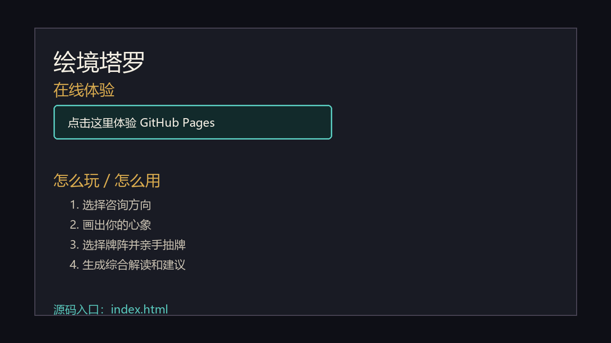

# 绘境塔罗

## 在线体验

[点击这里体验](https://dobbymiko.github.io/hui-jing-tarot/)

不需要安装，直接打开即可体验。没有 OpenRouter Key 时会自动使用离线演示模式。



## 怎么玩 / 怎么用

1. 打开在线体验链接。
2. 选择咨询方向，例如感情关系、婚姻家庭、事业发展、学业考试，也可以手动输入不超过 10 个字的方向。
3. 在画布上画出这件事带给你的心象或感受。
4. 选择牌阵深度，并从牌背中亲手抽牌。
5. 点击“翻牌并解读”，查看图案、咨询方向和塔罗牌合在一起的综合解读。
6. 在右侧继续追问，查看更具体的表达方式、下一步行动和注意点。

## 源码入口

源码在本仓库中可直接查看，主要文件如下：

- [index.html](index.html)：完整静态网页源码，包含 HTML/CSS/JavaScript。
- [tarot-table-bg.png](tarot-table-bg.png)：页面背景图。
- [docs/demo-walkthrough.gif](docs/demo-walkthrough.gif)：README 演示动图。
- [README.md](README.md)：项目说明。

## 本地运行

这是一个原生静态网页项目，不需要安装依赖或构建。

```bash
python -m http.server 5177
```

然后打开：

```text
http://127.0.0.1:5177/
```

也可以直接用浏览器打开 `index.html`。如果浏览器限制 `file://` 页面发起在线请求，建议使用上面的本地静态服务方式。

## BYOK 与 OpenRouter

本项目支持 BYOK（Bring Your Own Key）。

- API 服务：OpenRouter API。
- API Key 填写位置：页面首页的“OpenRouter 设置 / BYOK”折叠面板。
- 默认 `model_id`：`qwen/qwen3-vl-8b-instruct`。
- Key 保存方式：可选“只在本机保存 Key”，使用浏览器 `localStorage` 保存。
- 未填写 Key：自动进入离线演示，不消耗 token。

真实 API Key 不应写入源码、README、提交记录或 issue。仓库中只保留输入框占位符和使用说明。

## 项目说明

绘境塔罗是一个 AI 原生塔罗小游戏 Demo。玩家用图画表达问题，再亲手抽牌；系统把咨询方向、画布图像和塔罗牌阵提交给视觉语言模型，生成象征性解读和更落地的建议。

当前体验重点：

- 支持热门咨询方向和 10 字以内自定义方向。
- 支持画布绘制与图像输入。
- 支持 1 张、3 张、5 张牌阵。
- 支持 OpenRouter 在线模型和离线演示兜底。
- 支持追问互动，并把本局图案和牌面固定在右侧参考区。

## 安全边界

本项目仅用于娱乐和自我反思，不构成心理诊断、治疗建议、法律建议、财务建议或命运承诺。若内容触发强烈痛苦，请优先联系现实中可信赖的人或当地紧急援助。
